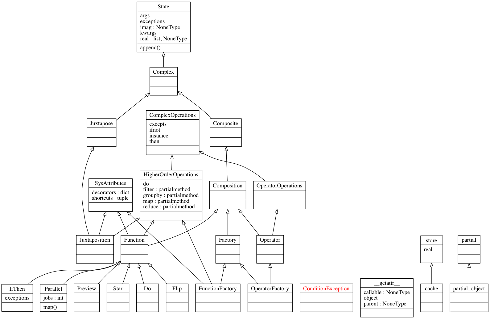

# `composites` compose complex functions

`composites` are untyped functional programming objects in Python _with all the side effects_.  `composites` make it easier to compose/pipeline/chain callables, classes, and other objects into higher-order functions.

                pip install git+https://github.com/tonyfast/composites

# compose functions with `a`, `an`, `the`, or `λ`

    from composites import *; assert a is an is the

A basic example, __enumerate__ a __range__ and create a __dict__ionary.

    f = the[range][reversed][enumerate][dict]
    f(3), f
---

    ({0: 2, 1: 1, 2: 0}, <composites.Function at 0x10e0eba68>)

Each <b><code>[bracket]</code></b> may accept a __callable__ or __iterable__. In either case,
a __callable__ is appended to the composition.  Compositions are immutable and may have
arbitrary complexity.

    g = f.copy()  # copy f from above so it remains unchanged.
    g[type, len]
    g[{'foo': a.do(print).len(), 'bar': the.identity()}]

    <composites.Function at 0x10e0eba68>

Brackets juxtapose iterable objects.

    the[range, type], the[[range, type]], the[{range, type}], the[{'x': range, 'y': type}]

    (<composites.Function at 0x10e0eed68>,
     <composites.Function at 0x10e12d048>,
     <composites.Function at 0x10e12d108>,
     <composites.Function at 0x10e12d1c8>)

Each each composition is immutable.

    assert f[len] is f; f

    <composites.Function at 0x10e0eba68>

# compose functions with attributes

Each composition has an extensible attribution system.  Attributes can be accessed in a shallow or verbose way.

    a.range() == a.builtins.range() == a[range]

    False

# compose functions with symbols

    assert a /  range == a.map(range)
    assert a // range == a.filter(range)
    assert a @  range == a.groupby(range)
    assert a %  range == a.reduce(range)

#### combine item getters, attributes, symbols, and other compositions to express complex ideas.

    f = a['test', 5, {42}] \
     / (a**str&[str.upper, str.capitalize]|a**int&a.range().map(
         a.range(2).len()
     ).list()|a**object&type) \
     * list
    f()

#### use compositions recursively

    f = a[:]
    f[a**a.gt(5)*range | a**a.le(5)*a.add(1)[f]](4)

    False

# Why functional programming with `composites`?

[Functional programming](https://en.wikipedia.org/wiki/Functional_programming) _often_ generates less code, or text, to express operations on complex data structures.  A declarative, functional style of programming approach belies Python's imperative, object-oriented (OO) 
nature. Python provides key [functional programming elements](https://docs.python.org/3/library/functional.html) that are used interchangeably with OO code.  

[`toolz`](https://toolz.readthedocs.io), the nucleus for `composites`, extends Python's functional programming with a set of 
un-typed, lazy, pure, and composable functions.  The functions in `toolz` look familiar 
to [__pandas.DataFrame__](https://tomaugspurger.github.io/method-chaining.html) methods, or [__underscorejs__](http://underscorejs.org/) and [__d3js__](https://d3js.org/) in Javascript.

An intermediate user of [`toolz`](https://toolz.readthedocs.io) will use 
[`toolz.pipe`](https://toolz.readthedocs.ioen/latest/api.html#toolz.functoolz.pipe),
[`toolz.juxt`](https://toolz.readthedocs.ioen/latest/api.html#toolz.functoolz.juxt), 
and [`toolz.compose`](https://toolz.readthedocs.ioen/latest/api.html#toolz.functoolz.compose) to create reusable, 
higher-order functions.  These patterns allow the programmer to express complex concepts 
with less typing/text over a longer time.  Repetitive patterns should occupy 
less screen space; `composites;` helps compose functions with less text. 
                      
A successful implementation of __composites__ should compose __un-typed__, __lazy__, and __serializable__ Python functions that allow
recursion.

# Syntax

A core property of `composites` is that it will not modify Python's abstract syntax tree, rather it expresses 
a large portion of Python's magic methods in the [data model](https://docs.python.org/3/reference/datamodel.html).  It considers Python's 
[order of operations](https://docs.python.org/3/reference/expressions.html#operator-precedence) in the api design.  `composites` provides symbolic expressions for common higher-order 
function operations like `map`, `filter`, `groupby`, and `reduce`. The attributes can access any of the `sys.modules;` with tab completion.

The efficiency of computing will continue to improve.  In modern collaborative development environments 
we must consider the efficiency of the programmer. Programming is a repetitive process requiring physical work from a person. 
__composites__ speed up the creation and reading repetitive and complex tasks.

## `composites` structure

# Development
    if __name__== '__main__':
        !jupyter nbconvert --to markdown --TemplateExporter.exclude_input=True readme.ipynb
        !jupyter nbconvert --to markdown --execute composites.ipynb
        !python -m doctest composites.py
        !echo complete

    [NbConvertApp] Converting notebook readme.ipynb to markdown
    [NbConvertApp] Writing 5152 bytes to readme.md

