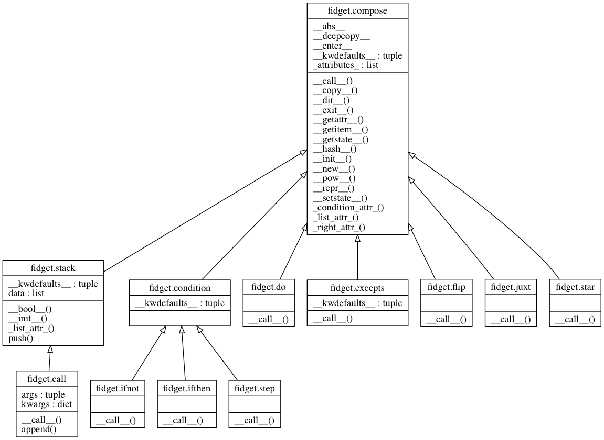

# `articles` compose functions

`articles` provides a generic chainable model for function compositions.  `articles` relies on 
a large portion of the python data model to create a typographically dense interface to function 
compositions.

                pip install git+https://github.com/tonyfast/articles
                
---
            
        

> `articles` is inspired by the `d3js`, `pandas`, `underscorejs`, and `toolz` apis.

   
               


```python
    from articles import *; assert a is an is the is λ
```

## compose functions using brackets

Each composition begins evaluation at the first element in the list.


```python
    f = the[range][list]; f
```


    λ:[<class 'range'>, <class 'list'>]


Brackets juxtapose iterable objects.


```python
    the[range, type], the[[range, type]], the[{range, type}], the[{'x': range, 'y': type}]
```


    (λ:[juxt((<class 'tuple'>,))[<class 'range'>, <class 'type'>]],
     λ:[juxt((<class 'list'>,))[<class 'range'>, <class 'type'>]],
     λ:[juxt((<class 'set'>,))[<class 'type'>, <class 'range'>]],
     λ:[juxt((<class 'dict'>,))[('y', <class 'type'>), ('x', <class 'range'>)]])


Each each composition is immutable.


```python
    assert f[len] is f; f
```


    λ:[<class 'range'>, <class 'list'>, <built-in function len>]


But it is easy to copy a composition.


```python
    g = f.copy() 
    assert g is not f and g == f and g[type] > f
```

# compose functions with attributes

Each composition has an extensible attribution system.  Attributes can be accessed in a shallow or verbose way.


```python
    a.range() == a.builtins.range() == a[range]
```


    True


```python
    a.dir().len()["""articles begins with {} attributes mostly from the standard lib.""".format].print()(a)
```

    articles begins with 1096 attributes mostly from the standard lib.


# compose functions with symbols


```python
    assert a /  range == a.map(range)
    assert a // range == a.filter(range)
    assert a @  range == a.groupby(range)
    assert a %  range == a.reduce(range)
```

## `articles` structure




```python
    !jupyter nbconvert --to markdown readme.ipynb
    !pyreverse -o png -bmy -fALL articles
    !jupyter nbconvert --to python --TemplateExporter.exclude_input_prompt=True articles.ipynb
    !python -m doctest articles.py
```
